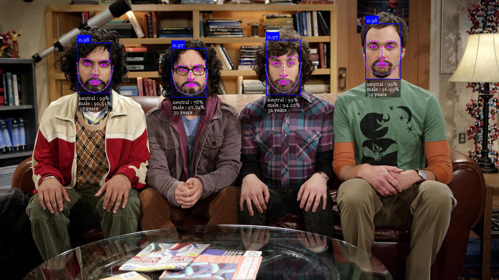
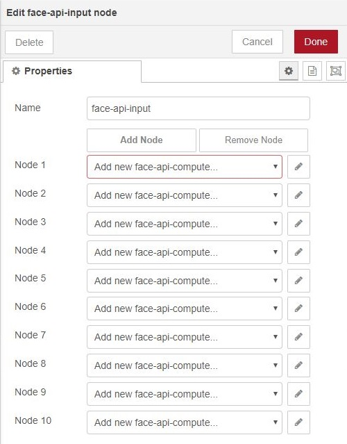
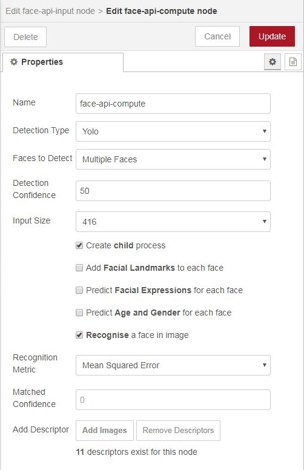

# node-red-contrib-face-recognition

This node aims to wrap the epic [Face-API.js library](https://github.com/justadudewhohacks/face-api.js) from [justadudewhohacks](https://github.com/justadudewhohacks) into a simple to import and use node in Node-Red. If you like anything in this repo be sure to also check out the original.



Usage of this node is designed to be very easy while allowing the user to choose any number of options exposed by the original face-api.js module. These are currently;

- __Face detection__
- __Facial Landmarks__
- __Facial Expressions__
- __Age and Gender Predictions__
- __Facial Recognition__

This module also utilizes the `child_process` module of Node.js to offload the complex calculations required to a separate thread. In turn, the offloaded task will not block the main event loop and allow Node-Red to continue other tasks. This is entirely optional and up to the user to decide to allow for better management of resources on a constrained device such as the Raspberry Pi.

## Installation

From your .node-red directory, you can run;

`npm install node-red-contrib-face-recognition`

or you can go to the pallette manager in Node-Red and find `node-red-contrib-face-recognition` in the install tab.

## Example Flow

As an example on how to use the node, below is a flow that grabs an image from the internet and runs inference over it. Copy and paste it into Node-Red to use, but make sure to install the following nodes from the pallet manager;

- node-red-node-base64
- node-red-contrib-image-output


```
[{"id":"5c9785ae.c524dc","type":"inject","z":"5a397940.a17aa8","name":"Input","topic":"","payload":"","payloadType":"date","repeat":"","crontab":"","once":false,"onceDelay":"","x":170,"y":80,"wires":[["bb3493cb.b73e2"]]},{"id":"2bdf00a.e8771","type":"image","z":"5a397940.a17aa8","name":"Labeled Image","width":"640","x":860,"y":180,"wires":[]},{"id":"16eacc92.6a4173","type":"image","z":"5a397940.a17aa8","name":"Input Image","width":"640","x":190,"y":180,"wires":[]},{"id":"beebc96a.133208","type":"change","z":"5a397940.a17aa8","name":"Set Payload to Image","rules":[{"t":"set","p":"payload","pt":"msg","to":"payload[\"TBB Faces\"].image","tot":"msg"}],"action":"","property":"","from":"","to":"","reg":false,"x":880,"y":140,"wires":[["2bdf00a.e8771"]]},{"id":"e0664c84.eb4f5","type":"debug","z":"5a397940.a17aa8","name":"Debug","active":true,"tosidebar":true,"console":false,"tostatus":false,"complete":"true","targetType":"full","x":830,"y":80,"wires":[]},{"id":"bb3493cb.b73e2","type":"http request","z":"5a397940.a17aa8","name":"Get Image","method":"GET","ret":"bin","paytoqs":false,"url":"https://thumbor.forbes.com/thumbor/960x0/https%3A%2F%2Fblogs-images.forbes.com%2Fmaddieberg%2Ffiles%2F2017%2F09%2Fbigbangtheorytv_s05e01_05-_h_2017.jpg","tls":"","proxy":"","authType":"basic","x":330,"y":80,"wires":[["c70b7138.ebfc7","75806a6d.7a55b4"]]},{"id":"c70b7138.ebfc7","type":"base64","z":"5a397940.a17aa8","name":"","action":"","property":"payload","x":180,"y":140,"wires":[["16eacc92.6a4173"]]},{"id":"75806a6d.7a55b4","type":"face-api-input","z":"5a397940.a17aa8","name":"Find Faces","numNodes":1,"computeNode1":"5adfec11.8f4ef4","computeNode2":"","computeNode3":"","computeNode4":"","computeNode5":"","computeNode6":"","computeNode7":"","computeNode8":"","computeNode9":"","computeNode10":"","x":510,"y":80,"wires":[["e0664c84.eb4f5","beebc96a.133208"]]},{"id":"5adfec11.8f4ef4","type":"face-api-compute","z":"","name":"TBB Faces","childHost":true,"recognitionType":"SSD","multipleFaces":"Multiple Faces","confidence":"50","inputSize":"416","landmarks":true,"expressions":true,"ageGender":true,"recognition":false,"labelName":"known","file":""}]
```
## TensorFlow for Node.js (Optional)

You can also optionally install TensorFlow for Node.js to make this package run faster. If you do not, the node will still run albeit much slower. To install TensorFlow navigate to your `.node-red` folder and run the following command. This will install TensorFlow in your Node-Red directory for use by the node.

`npm install @tensorflow/tfjs-node`

> There are known issues with the working combinations version of Node.js, @tensorflow/tfjs-node and face-api.js. At the time of writing this, on a windows environment these were found to be;
> - Node.js: 10.16.3
> - @tensorflow/tfjs-node: 1.2.11
> - face-api.js: 0.21.0 

> Please install these to gain the speed of the tf c++ backend and keep up to date on the face-api.js GitHib page for any errors relating to this.

## Included Nodes

This module comes with two nodes; the `face-api-input` node and `face-api-compute` node.

#### Input node



The `face-api-input` node acts as a pipeline between a flow and the compute nodes. Multiple compute nodes can be created and at least one must be selected for the input node to work. By using a config node based approach, multiple input nodes can share the same resources on your device allowing for a smaller memory footprint of the module.

The input node is capable of utilizing 10 compute nodes to process an image. The output of the input node is an array of results from each individual compute nodes containing information about found faces, the over layed image and individual inference time. 

To add multiple compute nodes to the input simply click the __Add node__ button in the edit dialog. This will add an option to select another compute node from a list of already created nodes. If you have multiple nodes but do not fill in any of them, they will be ignored. Only Node 1 is required.

By design, if a node is computing and another image is sent to that node, it will be ignored until the compute node has finished. This allows users to use a stream of images as an input and not worry about queued images bogging down the event loop.

#### Compute Node



The `face-api-compute` node is where all the options are set and calculations done. There are numerous options, so as a brief outline these are;

- __Name__: The name of this specific node. Useful to change when you have multiple config nodes and need to know the difference between them. (defaults to "face-api-compute")

- __Detection Type__: The detection type to use. This is either `SSD` or `Yolo`, as `MTCNN` is not currently supported. (Defaults to SSD)

- __Faces to Detect__: The number of detections to calculate. Either all faces found as `"Multiple Faces"` or the highest confidence one as `"Single Face"`. (Defaults to Multiple)

- __Detection Confidence__: The minimum confidence score that each detected face much be above to be counted as a face. This option is available for both SSD and Yolo. (Defaults to 50%, Limited between 0 and 100)

- __Input Size__: The input size of the Yolo algorithm. This option is only available when using Yolo as the type. (Defaults to 416)

- __Child Process__: Select if you would like to run the algorithm in a `child_process`. This will offload from the main event loop but use more resources. Use carefully. (Defaults to true)

- __Facial Landmarks__: Select this if you would like to add facial landmarks of each face to the output. (Defaults to false)

- __Facial Expressions__: Select this if you would like to add a prediction of facial expressions of each face to the output. (Defaults to false)

- __Age and Gender__: Select this if you would like to add a prediction of the age and gender of each face to the output. (Defaults to false)

- __Recognise__: Select this if you would like to try recognise each face in the output. This will require adding a descriptor by uploading an image using the supplied add image button. (Defaults to false)

- __Recognition Metric__: Select the type of recognition metric to use when comparing faces with the recognition option. This is option is only shown when the recognise option is selected.

- __Matched Confidence__: This is the minimum cutoff value for recognition for each of the metrics. Keep in mind that the metrics will produce different ranges of values for recognition. This is option is only shown when the recognise option is selected.

- __Add Images__: Use this button to add an image to create a descriptors from. These descriptors will then be used in the compute node to predict against an input. This is option is only shown when the recognise option is selected.

- __Remove Descriptors__: Use this button to remove the currently stored descriptors. This is option is only shown when the recognise option is selected and is irreversible.

#### Adding a face descriptor

In order to use the facial recognition option, facial descriptors must be calculated first to allow a comparison between them and any input image. To do this, check `enable recognition`, then click `Add Images`. Once selected all images will be computed either on the next deploy if your node is new, or immediately if your node already exists.

Currently the node will compute the face descriptor in the main node-red thread. Due to this, the deploy action will be blocking until finished. This was by design so that the descriptors would be computed before using the compute node they are associated with. This may take some time if not using `tensorflow for nodejs`, so please be patient on deploys for large sets of images.

These descriptors are then saved to disk allowing it to survive restarts of Node-Red. A saved file will then be loaded on startup of Node-Red. Saving the descriptor is also safer than saving an image if your Node-Red instance is online as no data about the original image is stored.

#### Using the Child_Process

As stated the compute node can offload the calculations to a `child_process` to allow the Node-Red event loop to continue. In doing this, another instance of Node.js is spawned which takes a certain amount of resources. Due to this it may not be desirable to run the calculations in this child node. With the option available, you can choose how to run this node for your specific application.

> On a windows environment, each child process take approx 85MB of ram. This should be similar for other platforms.

> It should be noted that the child node does not speed up the calculation. It only unblocks the main thread

#### The Recognition Metric 

The original Face-api.js library only supports the Euclidean distance method of comparison between descriptors when matching faces. To extend this, this node also supports 3 more type of metrics. These are; __Manhattan__, __Chebyshev__, and __Mean Squared Error__.

The outputs of these metrics from the node are all mapped roughly to the same output values of around 0 to 10000. This was to make it easier to compare the usefulness of each and allow the user to set a cutoff value within a similar range for each metric.

From testing, __Mean Squared Error__ gives the highest contrasting results from known to unknown faces. If you have another metric you feel may be useful, feel free to submit a pull request or create a discussion as I can now implement it along with the others.

## Contributing

If you like this node and want to contribute feel free to fork this repo and make a pull request. New features and suggestions are welcome, and there are several features I would like to implement, but lack the Javascript knowledge in Node.js. These are;

- [ ] Help on implementing tfjs-node on all platforms.
- [ ] General code improvements and clean ups
